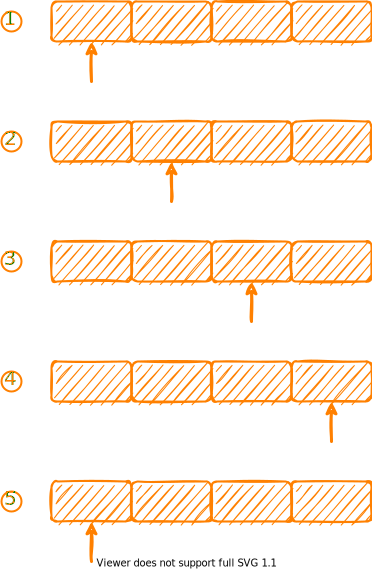

## 负载均衡
### 背景
在实际生产过程中，我们往往会通过集群的方式部署服务器，而不是单机部署，从而可以提高服务的并发能力。


但是这样部署产生了一个新的问题：如何决定某个请求发往的服务器？这就是负载均衡算法所需要解决的问题。

### 算法
目前比较常见的负载均衡算法有：
- 轮询法 (Round Robin)
- 随机法 (Random)
- 权重轮询
- 权重随机
- 哈希法
- 最小响应时间
- 最小连接


下面一一进行介绍

> 注意：为了简单，下面的代码未考虑并发，仅提供算法思路


#### 轮询法
轮询法属于最简单的负载均衡策略之一，它的意思是说，这一次请求选择的是 A 服务器，那么下一次请求我们就选择 A 后面的服务器，依次类推，到达最后一个位置之后，重新选择第一个服务器。



```go
func RoundRobin(servers []string) func() string {
  	// 保存访问位置
	pos := 0
	return func() string {
		res := servers[pos]
    	// 移动一个位置，下一次选择这个
		pos++
        // 如果达到最后一个
        if pos == len(servers){
          pos = 0 
        }
		return res
	}
}
```

#### 随机法
通过生成随机数，从而选择对应的服务器，算法十分简单
```go
func init(){
	// 随机数种子初始化
	rand.Seed(time.Now().UnixNano())
}

func Random(servers []string) string{
	index := rand.Intn(len(servers))
	return servers[index]
}
```


#### 权重轮询
在部署服务的时候，有些服务器可能性能好一点，有些服务器呢，性能差一点，这样的话，如果所有服务器平摊全部请求，肯定不好，那么我们可以给每一个服务器设置一个权重，权重越大，表示性能越好，可以接受更多的服务。比如说现在有两台服务器，A 服务器权重为 `3`，B 服务器权重为 `1`，那么平均下来，A 服务器应该接受 `3/4` 的请求，而B服务器接受 `1/4` 的请求。

一种很简单的思路就是将所有的服务器按照权重平铺延展，类似下图，然后使用轮询的方式


```go
type Server struct {
	ip     string
	weight int
}

func WeigthRoundRobin(servers []Server) func() string {
	pos := 0
	s := make([]string, 0, len(servers))

	for i := 0; i < len(servers); i++ {
		for j := 0; j < servers[i].weight; j++ {
			s = append(s, servers[i].ip)
		}
	}
	return func() string {
		res := s[pos]
		pos++
		if pos == len(s) {
			pos = 0
		}
		return res
	}
}
```

但是这种算法有所缺陷，那就是不平滑，在一个时间段中可能只有 A 服务器在用，但是 B 服务器可能都没有接收到任何请求，针对这种情况，出现了一种比较平滑的算法，`nginx` 中的权重轮询就是该类。该算法的思想是：
- 服务器的初始权重(`current`)为0，有效权重(`effective`)为设置的权重值，计算所有的权重和为 `total`
- 每一轮选择中，将当前的权重+有效权重，current 最大的为本次选中的服务器
- 选中该服务器之后，`current` 需要减去 `total`
- 进行下一轮

下面是权重为 `3` 的服务器 A 和权重为 `1` 的服务器 B 执行该算法的一整轮过程

| 请求次数 | current | 添加 effective 后 | total | 选中 | 选中后 current |
| :------: | :-----: | :-----------: | :---: | :--: | :-----------: |
|    1     | [0, 0]  |    [3, 1]     |   4   |  A   |    [-1, 1]    |
|    2     | [-1, 1] |    [2, 2]     |   4   |  A   |    [-2, 2]    |
|    3     | [-2, 2] |    [1, 3]     |   4   |  B   |    [1, -1]    |
|    4     | [1, -1] |    [4, 0]     |   4   |  A   |    [0, 0]     |

代码实现如下：
```go
func SmoothWeightRoundRobin(servers []Server) func() string {
	current := make([]int, len(servers))
	total := 0
	for i := 0; i < len(servers); i++ {
		total += servers[i].weight
	}

	return func() string {
		max := 0
		index := 0
		// 加入 effective 权重
		// 并且找到 current 权重最大的
		for i := 0; i < len(servers); i++ {
			current[i] += servers[i].weight
			if current[i] > max {
				max = current[i]
				index = i
			}
		}

		current[index] -= total
		return servers[index].ip
	}
}
```

#### 权重随机
权重随机可以类比权重轮询的第一种实现方式，下面直接给出代码
```go
func WeigthRandom(servers []Server) func() string {
	rand.Seed(time.Now().UnixNano())
	
	s := make([]string, 0, len(servers))

	for i := 0; i < len(servers); i++ {
		for j := 0; j < servers[i].weight; j++ {
			s = append(s, servers[i].ip)
		}
	}

	return func() string {
		index := rand.Intn(len(s))
		return s[index]
	}
}
```
除此之外还可以使用前缀和的思路，将所有的权重构成一个前缀和数组，比如说权重为`[1, 2,3]` 的时候，可以形成 `[0, 1, 3, 6]`，轮询的时候随机生成一个索引(`[0,6)`之间)，然后到数组中查找对应的范围，比如随机出 5，首先 `+1`，属于 `(3, 6]`，所以应该返回最后一个节点，也就是说返回大于等于 `随机数+1` 的前缀和数组值对应的节点，具体的算法实现见 `GitHub`[^1]

#### 哈希法
我们可以对请求中的某个特定属性计算哈希值，然后根据哈希值寻找对应的服务器节点。
```go
func HashLoadBalance(servers []string) func(key string) string {
	return func(key string) string {
		f := fnv.New32()
		f.Write([]byte(key))
		// 计算 hash 值
		h := f.Sum32()
		// 取模获取对应的服务器
		return servers[int(h)%len(servers)]
	}
}
```
> 也可以使用一致性哈希算法


#### 最小响应时间
负载均衡器需要统计服务端响应的时间，然后选择平均响应时间最小的服务器。
```go
// 响应时间统计
type RT struct {
  count int           // 多少次
	total time.Duration // 总时间
}

type LoadBalancer struct {
  servers []string
	rt      map[string]RT // 响应时间
}

func (l *LoadBalancer) LeastResponseTime() string {
  if len(l.servers) == 0 {
    return ""
	}
	// 初始化
	server := l.servers[0]
	min := l.rt[server].total / time.Duration(l.rt[server].count)

	// 选择最小的
	for i := 1; i < len(l.servers); i++ {
    rt := l.rt[l.servers[i]]
		average := rt.total / time.Duration(rt.count)
		if average < min {
      min = average
			server = l.servers[i]
		}
	}

	return server
}
```

#### 最小连接数
和最小响应时间类似，需要负载均衡器维护每一个服务器的连接，然后选择连接数量最少的服务器。


### 总结
负载均衡算法是集群部署时常用的算法，合理的负载均衡算法能够更好程度的利用我们的服务器资源，提高系统的承受能力，具体的算法的时候需要根据我们的需求进行选择，比如提供 websocket 服务的时候，应该使用 `哈希法`，根据客户端的 `IP` 地址计算访问的服务端，从而保证先后访问的服务端都是同一个服务端。


实现代码参见 `GitHub`[^1]


[^1]: https://github.com/junhaideng/LoadBalance


